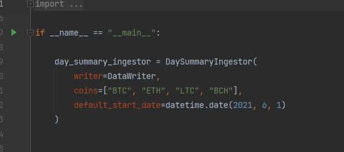
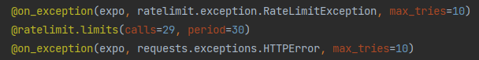
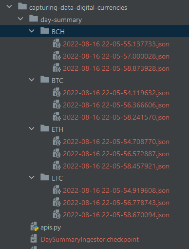

# Captura de cotação de moedas digitais

## Objetivo

Este projeto serve para a captura da cotação de criptomoedas utilizando a _API_ da https://www.mercadobitcoin.net e foi
criado para exercitar o uso de POO usando Python.

## Origem dos dados

API da https://www.mercadobitcoin.net.

Caso queira entender como a _API_ funciona, consulte: https://api.mercadobitcoin.net/api/v4/docs#tag/Public-Data

## Como usar

Para usar este projeto basta repassar uma lista de códigos ou um única código de moeda seguindo a documentação da API no
parâmetro _coins_ com possibilidade de filtro por data no formato datetime.date no parâmetro _default_start_date_ no
arquivo main.py.

## _Limits_ implementados

Para não consumir a _API_ sem limites, alguns cuidados foram implementados

## O que é gerado

Ao executar o projeto, serão criados diretório(s) para cada moeda informada em _coins_ e gerados arquivos .json nos
diretórios recém criados. Também é gerado um arquivo .checkpoint apenas para armazenar a última data solicitada à _API_
do Mercado BitCoin.

## Observações finais

Este projeto foi criado exclusivamente para fins didáticos!